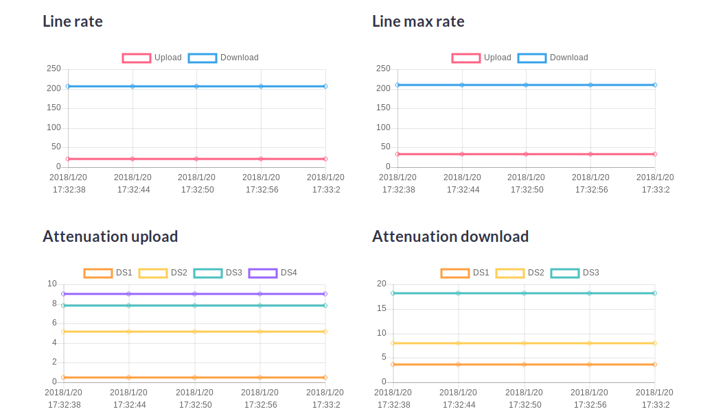

# SmartModemReader
Tim Smart modem statistics reader (DGA 4130)

### Command line usage
- Execute using default ip address: `dotnet run [sessionid]`
- Execute using custom ip address: `dotnet run [ipaddress] [sessionid]`

##### Sample output:

    xDSL statistics:
    Link online:       True
    Link uptime:       42days 0hours 56minutes 35seconds
    xDSL type:         VDSL2
    xDSL mode:         Fast
    Max rate up:       33.18
    Max rate down:     210.71
    Rate up:           21.6
    Rate down:         206.03
    Uploaded:          467.23
    Downloaded:        2801.11
    Out power up:      -23.9
    Out power down:    14.4
    Attenuation up:    0.5,5.2,7.8,9
    Attenuation down:  3.6,8,18.2
    Noise margin up:   11.4
    Noise margin down: 5.9

### Web app
- Execute using default ip address: `dotnet run web [sessionid]`
- Execute using custom ip address: `dotnet run web [ipaddress] [sessionid]`

##### Web app screenshot

